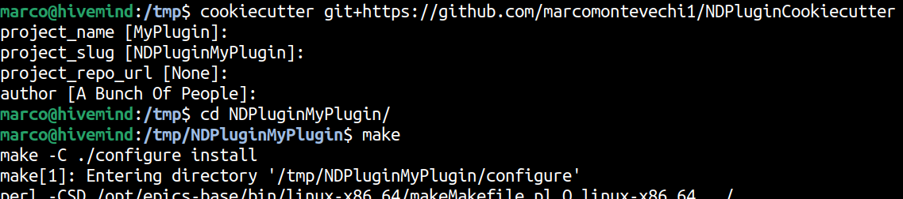
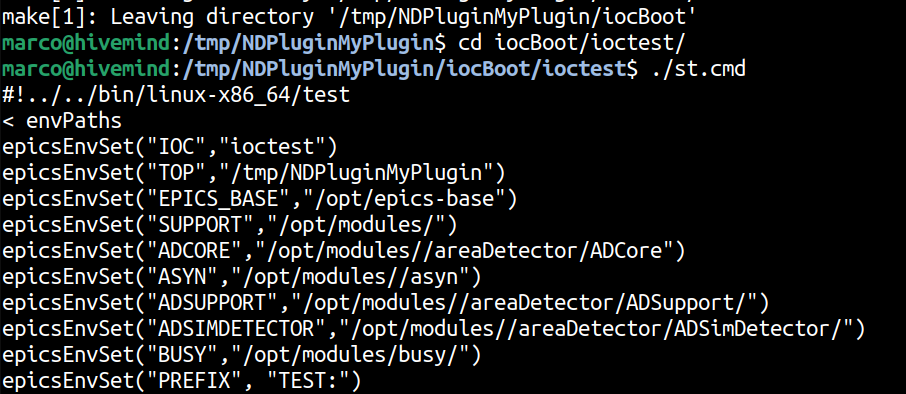

# Cookiecutter for EPICS AreaDetector NDPlugin

- [Cookiecutter](https://cookiecutter.readthedocs.io/en/stable/) is a way to quickly create project from templates. This repository is a template with a configuration file.
- [EPICS](https://epics-controls.org/) is a open-source distributed control software development framework. It is also a strong collaborative community.
- [AreaDetector](https://areadetector.github.io/areaDetector/index.html) is a collection of EPICS modules designed to control detectors and acquire and process their data.

This repository is a cookiecutter template for an EPICS areaDetector plugin. Plugins are often used to process or manipulate data acquired with areaDetector. 
For now, it has been primarily tested with `project_name = MyPlugin`, so if you happen to find any reminiscent of the name "MyPlugin" in the source files, it probably shouldn't 
be there (Except in the `iocBoot/ioctest/st.cmd` file, that's just the port name).

## Usage and Test application

It comes with a ready-to-use test application in `testApp` directory so you can quickly test your plugin. The application should generate the binary in the `iocBoot/ioctest/st.cmd` shebang, so all you have to do is:

```
cookiecutter git+https://github.com/marcomontevechi1/NDPluginCookiecutter
(...) # Choose cookiecutter options
cd NDPluginMyPlugin/iocBoot/ioctest
make # See compilation topic below
./st.cmd
```

and enjoy your plugin.




## Compilation

To compile your plugin, simply change EPICS_BASE, SUPPORT, ADCORE, etc. paths in `configure/RELEASE` to the PATHS of the EPICS system in your host machine.
